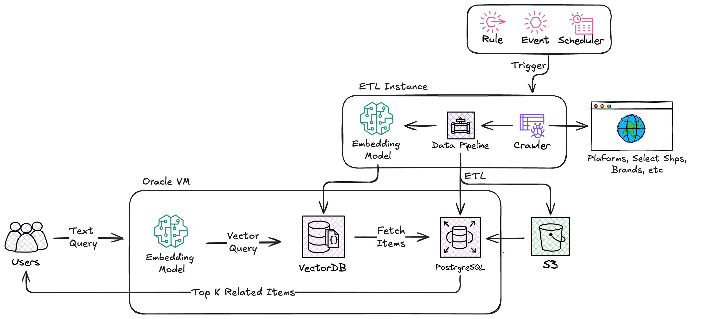
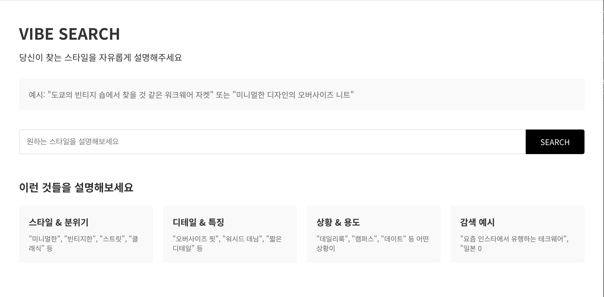
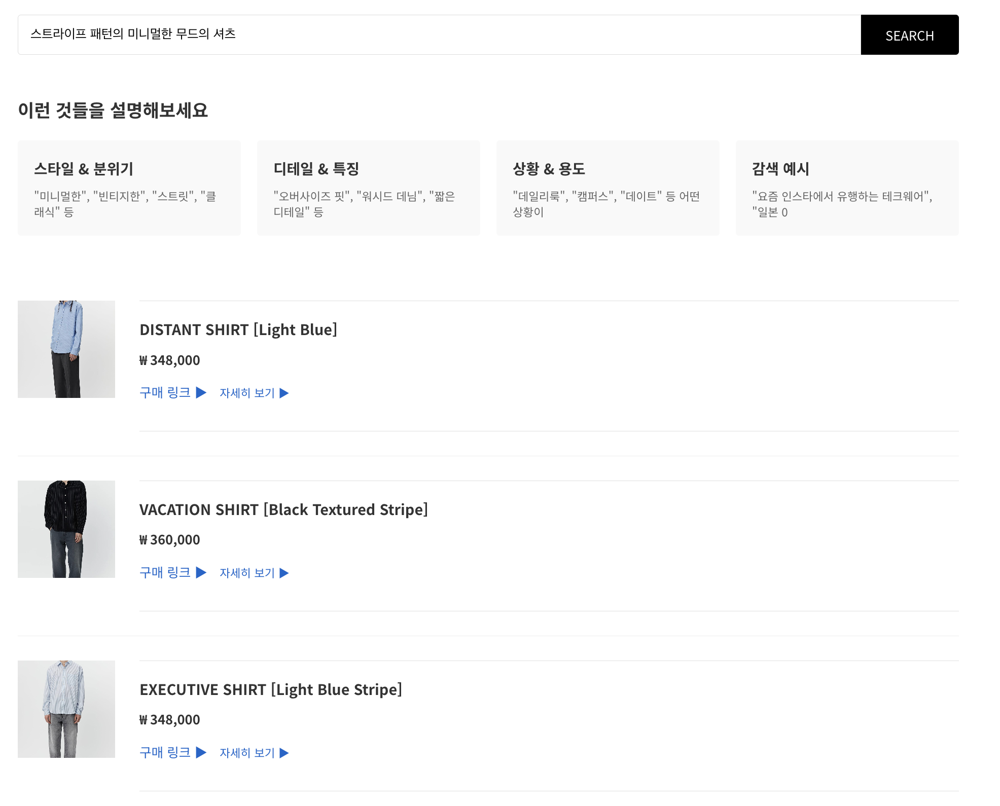
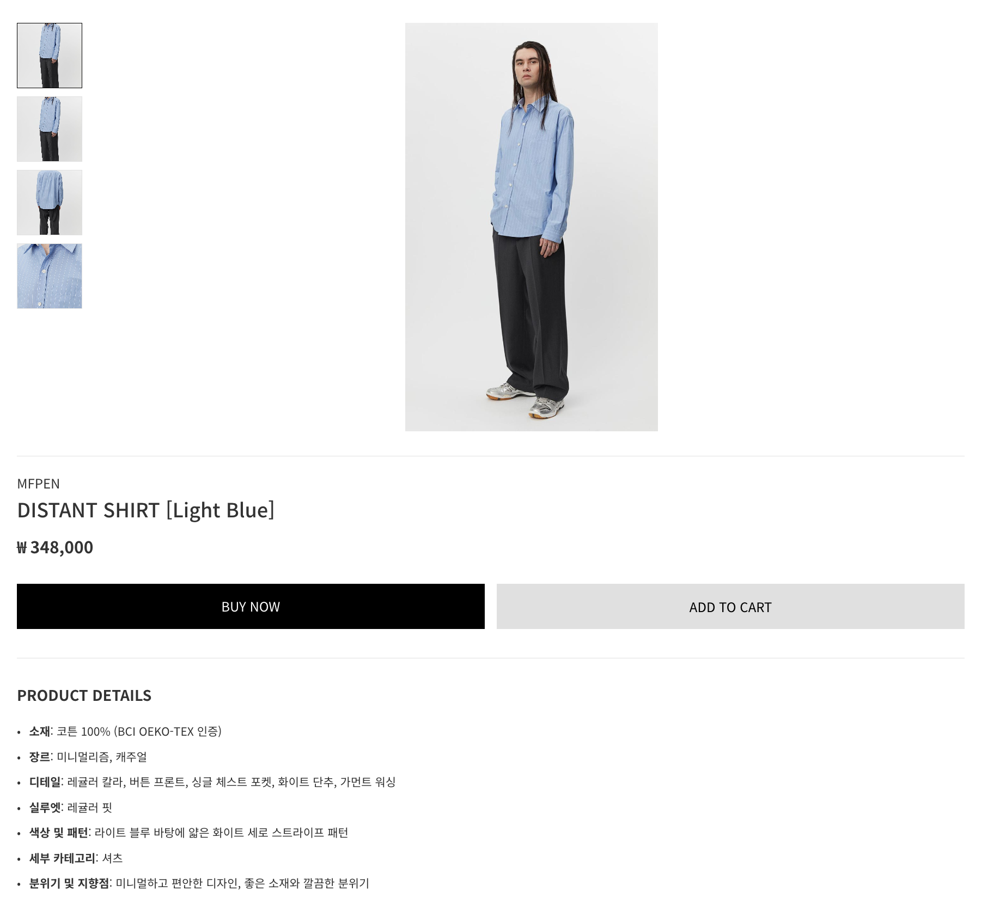
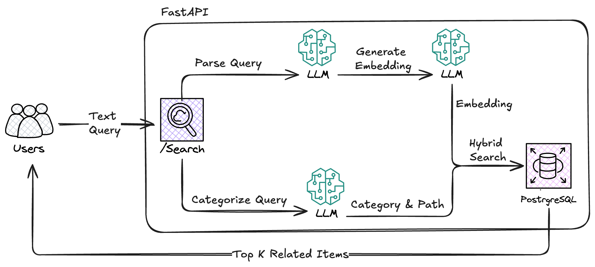

# Vibe Searching

https://prototype.p-picker.com/


이 서비스는 **텍스트 입력을 통해 원하는 스타일의 옷을 제안하는 Vibe Searching Prototype**입니다.  
Fastapi + React + Postrgresql 기반으로 구현되어 있으며, 유저 로그인 등의 인터랙션 없이 기능은 제외한 프로토타입입니다.
현재는 top - 3 related items를 제안합니다.

##  System Architecture Overview



## 데모 화면 및 설명

### 1. 메인 화면

텍스트 입력창에 원하는 스타일을 간단히 작성합니다.



### 2. 추천 결과 (예시)

입력: **"스트라이프 패턴의 미니멀한 무드의 셔츠"**



위와 같이 Top-3 관련 상품이 카드 형태로 표시됩니다.

### 3. 상품 디테일 페이지

클릭 시 상세 정보(이미지, 가격, 설명, 구매 링크 등)를 제공합니다.




# 🔍 패션 상품 하이브리드 검색 시스템

## 📋 개요

자연어 쿼리를 구조화된 데이터로 변환하고, 카테고리 필터링과 벡터 유사도 검색을 결합한 하이브리드 검색 시스템입니다.

## 🏗️ 시스템 아키텍처



## 🚀 검색 플로우

### 1. 쿼리 입력 단계
```
입력: "도쿄 빈티지 워크웨어 자켓"
```

### 2. 병렬 처리 단계 (비동기)
```python
# 두 함수를 동시에 실행하여 응답시간 단축
query_json, category = await asyncio.gather(
    parse_fashion_query(q),    # 구조화된 JSON 생성
    query_categorizer(q)       # 카테고리 분류
)
```

#### 2-1. 패션 쿼리 파싱 (`parse_fashion_query`)
**입력:** `"도쿄 빈티지 워크웨어 자켓"`

**출력:**
```json
{
  "소재": null,
  "장르": "워크웨어",
  "카테고리": "outer",
  "실루엣": null,
  "색상 및 패턴": null,
  "세부 카테고리": "자켓",
  "분위기 및 지향점": "도쿄 빈티지 숍 느낌"
}
```

#### 2-2. 카테고리 분류 (`query_categorizer`)
**입력:** `"도쿄 빈티지 워크웨어 자켓"`

**출력:** `"jacket"`

### 3. 임베딩 생성 (순차 처리)
```python
q_emb = embedder.embed(query_json)  # 구조화된 데이터를 벡터로 변환
```

### 4. 하이브리드 검색 실행

#### 4-1. 카테고리 경로 조회
```sql
SELECT path::text AS path, nlevel(path) AS depth 
FROM category WHERE name = 'jacket'

-- 결과: path='outer.jacket', depth=2
```

#### 4-2. 하이브리드 필터링 및 검색
```sql
SELECT p.id, p.name, p.original_price AS price,
       p.url AS link, p.brand, p.thumbnail_key,
       p.category_path
FROM products AS p
WHERE p.category_path <@ 'outer.jacket'::ltree    -- 카테고리 + 하위 필터
  AND p.genre && ARRAY['워크웨어']                 -- 장르 배열 겹침 필터
ORDER BY p.embedding <#> query_embedding          -- 벡터 유사도 정렬
LIMIT 40
```

### 5. 결과 후처리
- Presigned URL 생성 (S3 이미지 링크)
- ProductResponse 객체 변환

## 🔧 핵심 컴포넌트

### 1. 비동기 쿼리 번역 시스템


#### Few-shot Learning 프롬프트
- 예시 기반 학습으로 일관된 JSON 구조 출력
- 11개 패션 장르 분류 지원
- 카테고리별 세부 분류 (top/bottom/outer/accessory)

### 2. 카테고리 계층 검색

#### ltree 기반 계층적 검색
```sql
-- outer.jacket 검색 시
WHERE category_path <@ 'outer.jacket'::ltree

-- 포함되는 항목들:
-- ✅ outer.jacket (정확한 매칭)
-- ✅ outer.jacket.denim (하위)
-- ✅ outer.jacket.bomber (하위)
-- ❌ outer.coat (다른 카테고리)
```

### 3. 벡터 유사도 검색

#### pgvector inner-product 연산
```sql
ORDER BY p.embedding <#> query_embedding
```
- 구조화된 쿼리 데이터를 임베딩으로 변환
- 상품 임베딩과 유사도 계산
- 의미적 유사성 기반 정렬

## 📊 검색 전략

### 하이브리드 필터링 순서
1. **카테고리 필터** (계층적): 관련 카테고리 + 하위 항목들
2. **장르 필터** (배열 겹침): 사용자 의도와 일치하는 스타일
3. **벡터 유사도** (정렬): 의미적 관련성 순서

### 예외 처리
- **카테고리 "None"**: 전체 검색으로 대체
- **API 실패**: 자동 재시도 + 키 로테이션
- **빈 결과**: 점진적 필터 완화

## 🎯 검색 결과 예시

### 입력
```
"미니멀한 오버사이즈 니트"
```

### 처리 과정
1. **파싱 결과:**
   - 장르: "미니멀리즘"
   - 카테고리: "top"
   - 실루엣: "오버사이즈"
   - 세부 카테고리: "니트"

2. **카테고리 분류:** `"knit"`

3. **검색 조건:**
   ```sql
   WHERE category_path <@ 'top.knit'::ltree
     AND genre && ARRAY['미니멀리즘']
   ORDER BY embedding <#> query_embedding
   ```

4. **결과:** 미니멀리즘 스타일의 니트 상품들을 유사도 순으로 반환

## 🛠️ 기술 스택

- **웹 프레임워크**: FastAPI (비동기 처리)
- **AI 모델**: Google Gemini 2.5 Flash (쿼리 파싱/분류/Embedding) 
- **벡터 DB**: PostgreSQL + pgvector
- **계층 관리**: ltree 확장
- **이미지 저장**: AWS S3
- **동시성**: asyncio.gather() (병렬 처리)

## 🔄 성능 최적화

### 1. 비동기 병렬 처리
- 쿼리 파싱과 카테고리 분류를 동시 실행
- 전체 응답 시간 ~50% 단축

### 2. API 키 로테이션
- 장애 발생 시 자동 failover

### 3. 계층적 검색
- ltree 인덱스 활용으로 빠른 카테고리 필터링
- 벡터 검색과 결합하여 정확도/성능 균형

